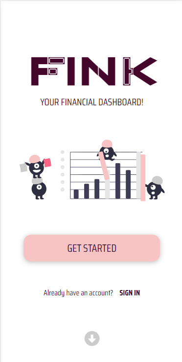
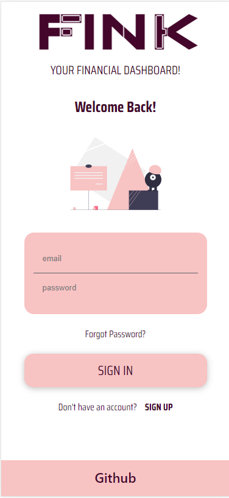
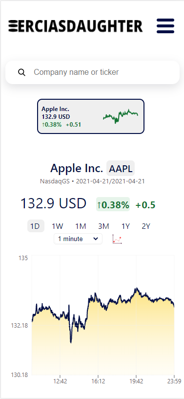

# Your Financial Dashboard App

## Developers 👷

[Melinda Sava](https://github.com/mellyynda), [Filipa Spajic](https://github.com/cr4y0n), [Vanessa Martinez](https://github.com/Vaanessa), [Sascha Kasapovski](https://github.com/Apotheosiz), [Emma Franzén](https://github.com/EmmaFranzen)

## Table of contents 📋
* [**Description**](#Description-)  
* [**Demo**](#Demo-)
* [**Features**](#Features-)
* [**Future-Features**](#Future-Features-)
* [**Project-Status**](#Project-Status-)
* [**Technologies**](#Technologies-)
* [**Links**](#Links-)

## Description ✏️

<FINK logo here>

****A functioning app with a sign-up page where you can search, favorite, unfavorite and show stock tickers last price and evolution while signed in. When selecting a ticker a graph will show you the stock evolution either by day, month or year, as well as news related to chosen ticker. The app can be customized after a specific client's company and it also has a company chat. Eventually a few more features like a more polished admin page will be added in the future.****

## Demo 📸
[CLICK HERE FOR HOSTED DEMO VERSION](http://finance_and_stocks_ladies.surge.sh/)

  

## Features ✨
**List of features available:**
* Account page, sign up/sign in
* Company sign in with assigned styles
* Search for tickers
* Favorite/Unfavorite tickers
* Shows closing price and graph for selected and followed tickes
* Graph customization by day, month, year and time period 
* Shows highest and lowest price sold for the selected interval
* News articles related to ticker which link to the original source
* Comment section per company with save, edit and remove function

## Future Features 🔮
**List of features to be added:**
* Candelstick graph
* Dark mode
* Polished admin page
* More customizations available for users in account settings
* Upload profile picture feature
* More default profile pictures with color variation to choose from
* Statistics for tickers and news on home page
* Trending tickers
* More graphs
* Crypto currency API

## Project Status 📃
Functioning app with a good deal of features

## Technologies 🛠
**Languages:**
 - HTML5 
 - CSS 3
 - Javascript

**Libraries:**
- React Firebase
- [Charts.js](https://www.chartjs.org/)
- [Recharts](https://recharts.org/en-US/)
- [Canvas JS](https://canvasjs.com/javascript-candlestick-chart/)
- [Apex Charts](https://apexcharts.com/javascript-chart-demos/candlestick-charts/)

**APIs**
- [Polygon](https://polygon.io/)
- [News API](https://newsapi.org/docs/get-started)
- [Financial Modeling Prep](https://financialmodelingprep.com/developer/docs/)
    
**Prototype sites:**
-  [Figma](https://www.figma.com/)

## LINKS 🔗

- [Surge](http://finance_and_stocks_ladies.surge.sh/)

- [Trello Board](https://trello.com/b/My2vmXXG/tp2)

- [FIGMA Prototype for Desktop Updated](https://www.figma.com/file/AuE4RMzRrzPnJ5or4vCQ5S/Untitled?node-id=0%3A1)
- [FIGMA Prototype for Desktop Old](https://www.figma.com/file/OMpkcUXgKIBRCjtFRRtPEe/Untitled?node-id=0%3A1)
- [FIGMA Prototype for Phones](https://www.figma.com/file/aAqVMGOUdihnXUbeRR6olj/TP2-mobile-prototype?node-id=0%3A1)
- [FIGMA Prototype Colors](https://www.figma.com/file/TgqNneJZhTUzUbhQJk7Uof/Untitled?node-id=0%3A1)
